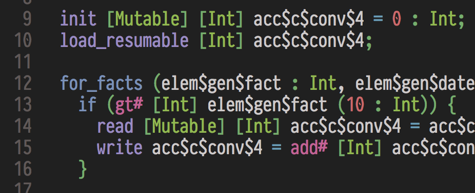

Icicle Mode for Vim
===================




Syntax highlighting for Icicle Source, Icicle TOML, and Avalanche.


## Installation

The easiest way to install Icicle Mode for Vim is to use a plug-in
manager like [vim-plug](https://github.com/junegunn/vim-plug).

If using `vim-plug`, simply add the following to your `~/.vimrc`:

```vim
Plug 'ambiata/icicle-vim'
```

Then run `:PlugInstall`.
